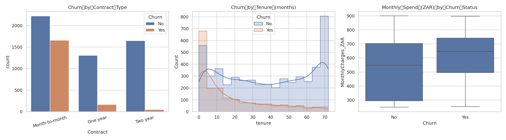
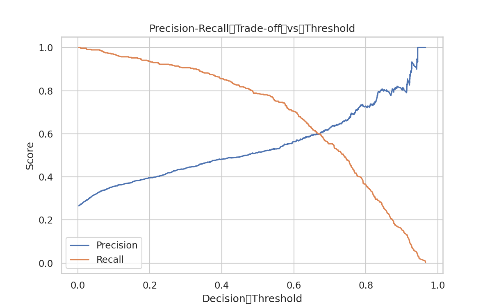
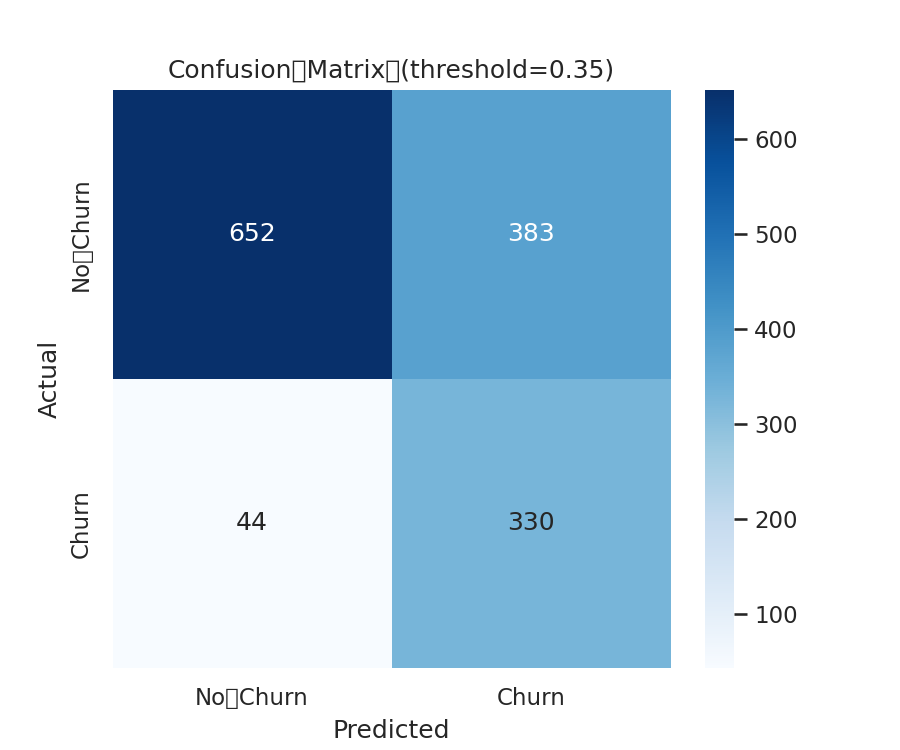
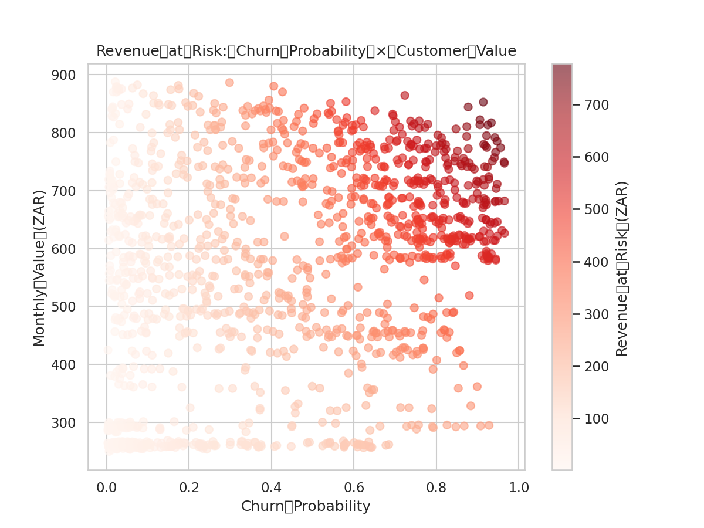
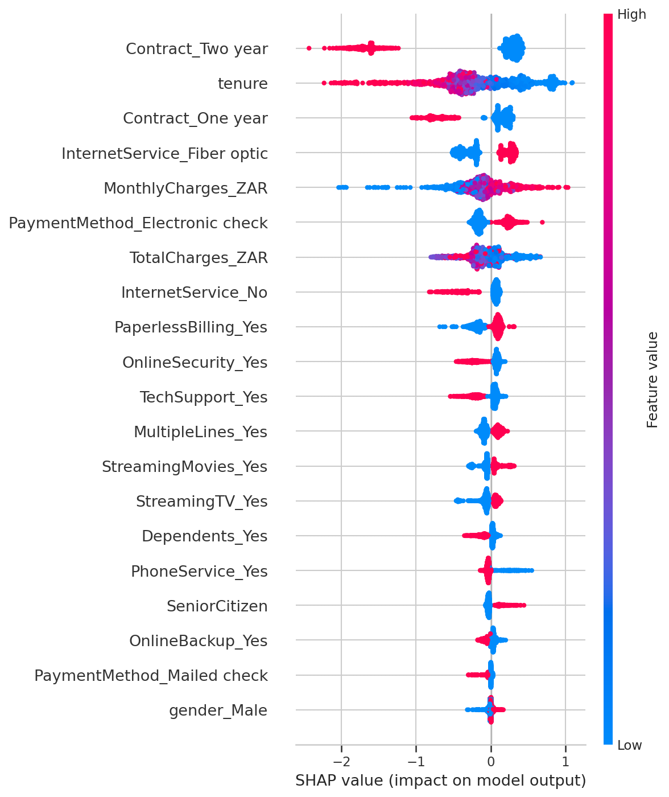

# SA Telecom Churn Prediction with Revenue-at-Risk Ranking

I noticed a lot of public discussion (news articles, Hello Peter complaints,
price-war headlines) about SA mobile customers switching networks over pricing
and data bundle changes, especially with RICA number-porting making it easy to
switch without losing your number. I wanted to see whether churn is actually
predictable from usage patterns, and more importantly, whether it's the
high-value customers or the low-value ones driving the losses, since that
changes what retention should actually do about it.

## Business question

Which customers are about to churn, how much monthly revenue does each one
represent, and who should the retention team call first given they can only
call a limited number of people per week?

## Methodology

- **Base dataset:** the widely-used Telco Customer Churn dataset, rescaled to
  realistic South African postpaid mobile ARPU bands (R250-R900/month) so the
  business framing reflects the local market rather than a generic US copy.
- **Baseline vs stronger model:** Logistic Regression compared honestly
  against XGBoost, rather than assuming the more complex model automatically
  wins.
- **Model explainability:** SHAP used to identify which features actually
  drive the model's predictions, in plain business language rather than
  model jargon.
- **Revenue-at-risk ranking:** churn probability x monthly value, used to
  prioritize retention calls by actual dollar exposure rather than raw churn
  probability alone.

## Exploratory data analysis

Before modeling, I looked at churn rate by contract type, tenure, and monthly
spend. Month-to-month contracts churn at a dramatically higher rate than
longer contracts, and churn concentrates heavily in the first 10 months of
tenure, both patterns that show up again later in the SHAP results.

## Key findings

| Metric | Value |
|---|---|
| Logistic Regression ROC-AUC | 0.841 |
| XGBoost ROC-AUC | 0.840 |
| Recall at threshold 0.35 | 88% (330 of 374 churners caught) |
| Precision at threshold 0.35 | 46% (383 false positives) |
| Top revenue-at-risk segment | High churn probability + R600-800/month spend |
| Top 50 revenue-at-risk total | R34,244.31 in monthly recurring revenue |
| Dominant SHAP drivers | Contract type, tenure, monthly charges |
| Secondary SHAP drivers | Fiber optic service, electronic check payment |

**Result:** Logistic Regression and XGBoost performed almost identically,
which says something in itself: the churn signal in this data is largely
linear and well captured by a handful of strong features, not something that
needed a more complex model to uncover. At a decision threshold of 0.35, the
model trades precision for recall on purpose, since missing a high-value
churner costs the business more than a wasted retention call.

Ranking customers by revenue-at-risk rather than churn probability alone
surfaces a clear priority segment, customers with both high churn probability
and monthly spend in the R600-800 range. The top 50 customers by this score
represent R34,244.31 in monthly recurring revenue at risk.

SHAP confirms the model's predictions come down to three factors mostly:
contract type, tenure, and monthly charges, with fiber optic service and
electronic check payment as secondary but consistent effects.

## Recommendation

Retention should prioritize customers by revenue-at-risk score rather than
raw churn probability. Contract type and tenure being the dominant drivers
suggests a proactive lever earlier in the process too, offering a
contract-renewal incentive to month-to-month customers approaching the 6 to
10 month mark, before they ever reach the retention call list this model
generates.

## Data note

Base dataset is the Telco Customer Churn dataset, rescaled to realistic South
African postpaid mobile ARPU bands to reflect the local market context this
analysis is framed around.

## How to run

Open `notebooks/01_churn_revenue_risk.ipynb` in Google Colab, run top to
bottom. Kaggle authentication uses Colab Secrets (see notebook for setup).
Package versions in `requirements.txt`.
